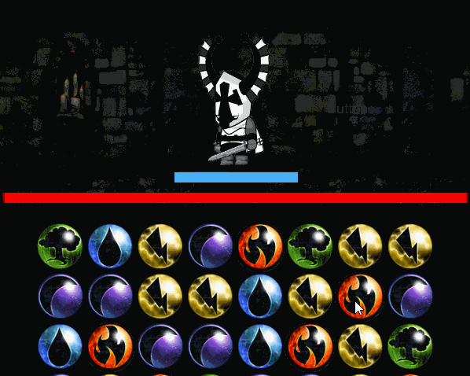
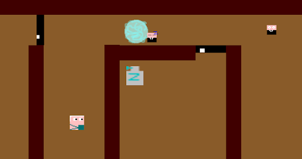

# **Francesco Torchi's Home page**

Hi! I'm **Francesco Torchi** and I'm currently studying **Game Design**.

As I like to work on both *level design* and *player's learning process*, I usually develop tutorial levels.

I also like to work on *serious games*, help people see things from a different perspective and learn something new in the process!

# **Projects**

## **Deforestation Sim** (*wip*)

**Deforestation Sim** is a tool that was created to help players learn and understand the causes of deforestation and to show how destructive human actions are for the planet.

## Mirror Worlds (*wip*)

**Mirror Worlds** is a single player puzzle game where the player, in order to reach it's goal, will have to redirect a ray of light using mirrors.

## **Nuke Alarm**

**Nuke Alarm** is a single player puzzle game where the player plays the role of the Secretary of State of different countries. His goal is to avoid a nuclear war; in order to do that, he will have to analyze the information at his disposal and figure out whether the threats are true or false.

## **Don't Listen** 

**Don't Listen** is a first person shooter with stealth elements. In order to reach their goal, players will have to carefully choose their route and manage their resources.

## **Other Projects**

## **Loot & Magic** 

A fast paced match 3 game

## **Anesthetist Quest**

The personal quest of an anesthetist against corporate greed

## **Gender Inequality**

An interactive story about gender inequality that uses colors to communicate the players what the main character is feeling.

